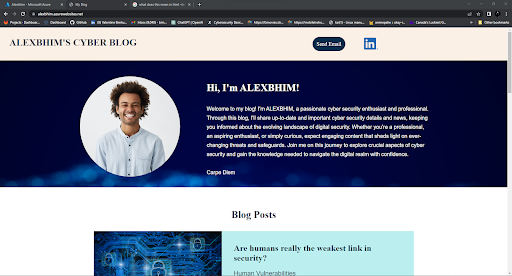
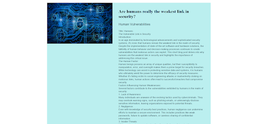

# Cybersecurity Project Alpha: Azure Web Application Deployment

This project demonstrates the creation and deployment of a secure web application using Microsoft Azure. It highlights fundamental concepts of cloud security, cryptography, and web application development.

## Features
- Hosted on Azure with a free domain: [alexbhim.azurewebsites.net](https://alexbhim.azurewebsites.net/)
- Secure configuration with TLS 1.2 and Azure Web Application Firewall (WAF).
- Backend runtime: PHP 8.2.
- Frontend assets include CSS and images for responsive and user-friendly design.
- Demonstrates cloud security concepts such as access policies, key vaults, and SSL/TLS certificates.

## Screenshots
  
  

## Full Technical Details
-[Technical Report](Technical%20Report.md)
-[Information Pdf](%20Project%201%20Technical%20Brief.pdf)

## Installation and Setup
1. Clone this repository:
   ```bash
   git clone https://github.com/Alexbhim/My-cybersecurity-notes/tree/main/Project-Alpha
